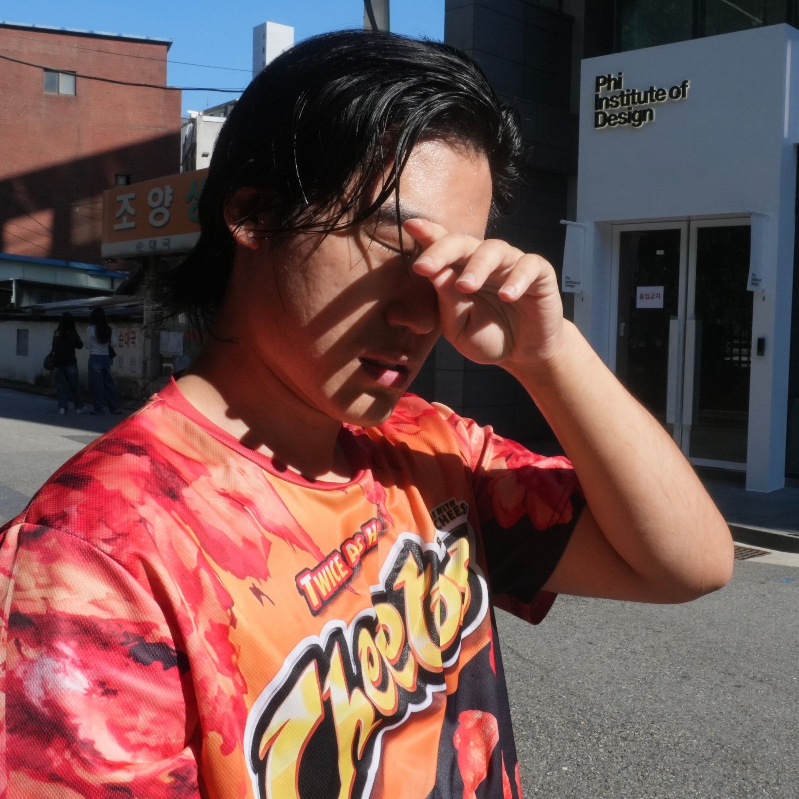
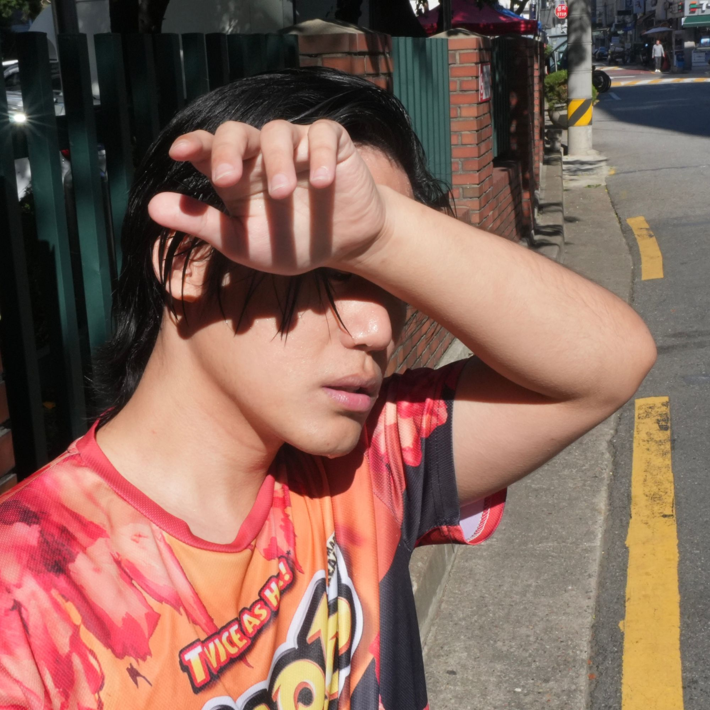
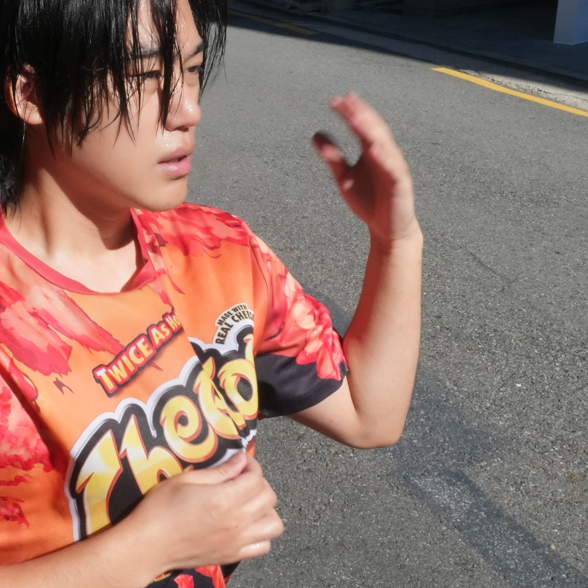
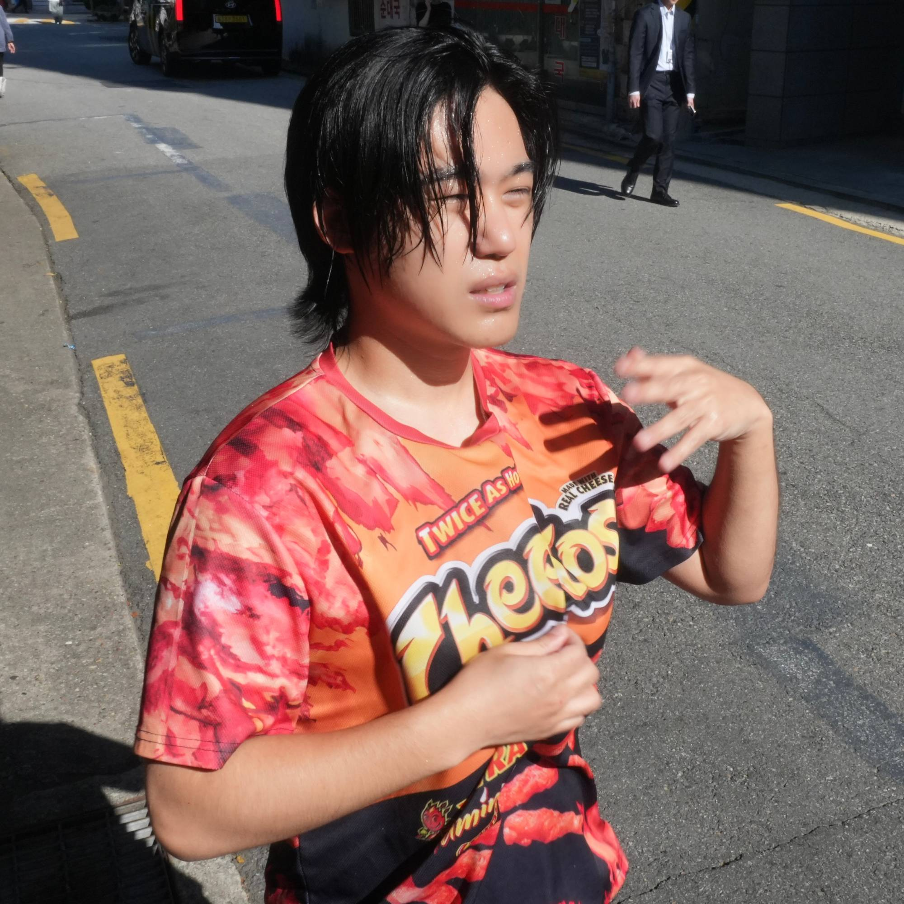

# 1007 — 저장소 세팅 · 코스 파악 · 기획 전환 · 1차 촬영

## 오늘 한 일
- GitHub 저장소(`yongzu/VT`)를 만들고 PC와 연결했다
- 코스프로필과 앨범 커버 가이드라인을 읽고 학습 목표(LO1~4)와 루브릭(OE)을 정리했다 → [CLAUDE.md](../CLAUDE.md)
- 기획안 「21°C」를 정리했다 → [CONCEPT.md](../CONCEPT.md)
- **기획 방향 전환**: '고상하고 세련된' 방향에서 '캐주얼하고 재치 있는' 방향으로 바꿨다(전문가 조언 반영)
  - 표현 전략: **사진은 덥게, 그래픽은 시원하게.** 이 대비로 전환을 보여 준다
- 1차 촬영 10컷을 정리했다

## 1차 촬영본

| | | | | |
|---|---|---|---|---|
|  |  |  |  |  |
| 01 | 02 | 03 | 04 | 05 |
|  |  |  |  |  |
| 06 | 07 | 08 | 09 | 10 |

## 피드백 (루브릭 기준)

**방향 전환 (LO3 OE2: 기획을 고쳐 쓰기)**
- '사진은 덥고 그래픽은 시원하다'는 구조 덕분에, 기획 첫 문장인 '같은 숫자, 다른 감각'의 바깥과 안을 한 장에 함께 담을 수 있다.

**사진별 판단 (기준: 그래픽이 들어갈 자리가 있는가)**
- **06** (아스팔트에 대자로 누운 컷): 재치가 가장 강하고, 넓은 아스팔트 여백에 '시원함' 그래픽을 넣을 수 있다
- **05, 09, 10** (티셔츠로 부채질하는 크롭): '찝찝함'이 몸짓으로 드러나고, 여백이 넓어 바람·냉기 그래픽을 얹기 좋다
- **02, 04**: 땀과 강한 그림자로 열기는 가장 잘 읽히지만, 배경이 복잡해 그래픽이 들어갈 자리가 좁다
- **01, 03**: 01은 그늘이라 오히려 시원해 보이고, 03은 간판 정보가 강하다. 우선순위가 낮다

**짚어 볼 점 (LO4 OE1, LO1 OE2·3)**
- 치토스 로고가 화면에서 가장 큰 목소리를 낸다. "TWICE AS HOT"은 더위에 대한 좋은 말장난이지만, 그대로 두면 타이틀 「21°C」와 경쟁한다. 열기 장치로 적극적으로 쓸지, 크롭이나 블러로 낮출지 의도적으로 결정해야 한다.
- 키워드가 5개(공기, 대비, 전환, 리듬, 입자)인데 가이드라인은 3개다. **대비·전환·공기**를 핵심으로 두고, 리듬·입자는 질감 수준의 하위 요소로 내리는 안을 검토한다.
- 앨범 소개의 "편집숍을 천천히 둘러보듯"은 이전의 고상한 톤이다. 재치 있는 톤에 맞게 다시 쓸지 검토한다.

## 합성 방향 후보 (협의용)
1. **경계면(자동문)**: 사진 한쪽을 깔끔한 그래픽 면으로 잘라 낸다. 면 안쪽은 채도와 노이즈를 빼고 차갑게 만든다
2. **에어컨 디스플레이**: 「21°C」를 7-세그먼트 숫자로 크게 넣고, 송풍 라인이 몸 위로 지나가게 한다 (06번 컷과 조합)
3. **냉기 입자**: 06이나 10의 여백에 차가운 입자와 바람결을 그래픽으로 뿌린다

## 다음 할 일
- [ ] 사진과 그래픽을 합치는 방식 협의 (~1011 일)
- [ ] 합친 초안 만들기
