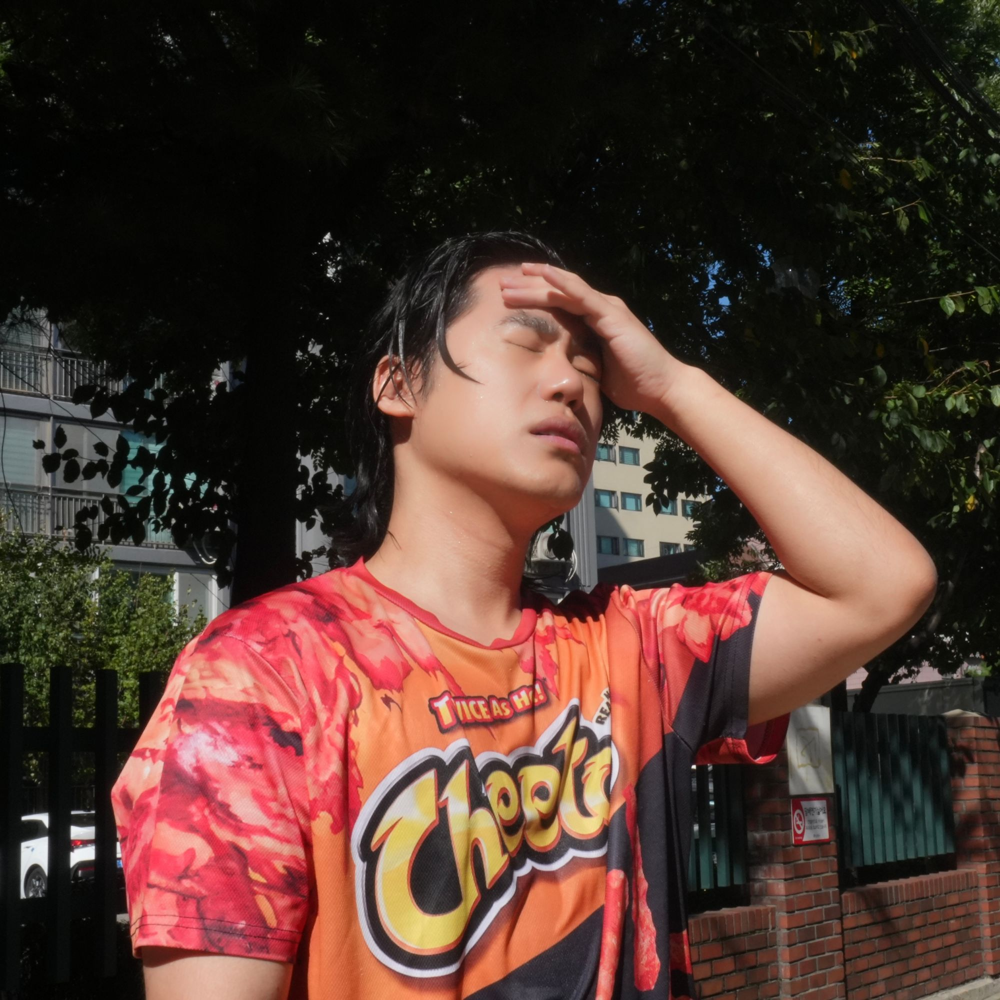
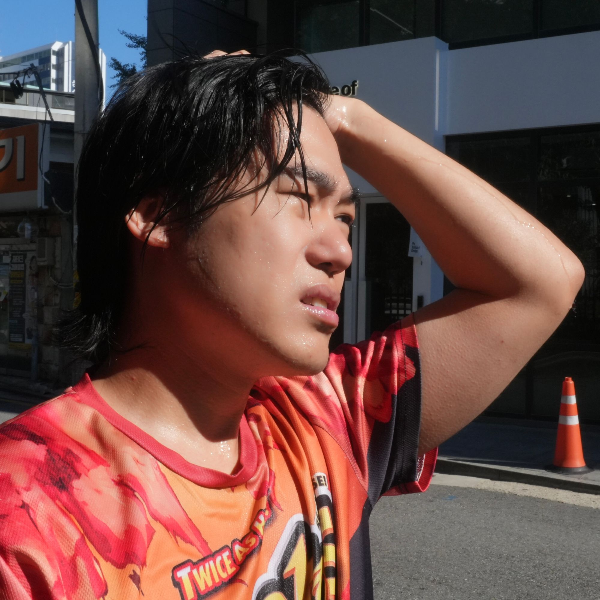
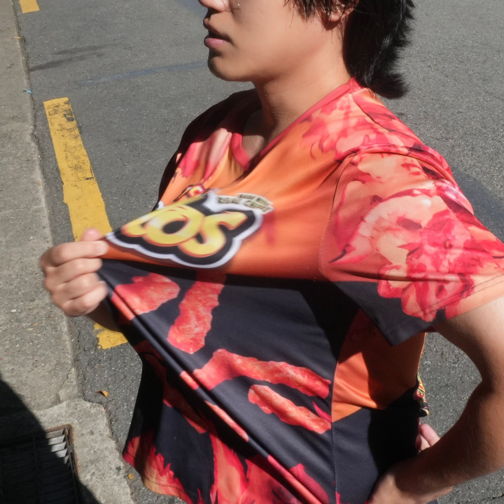
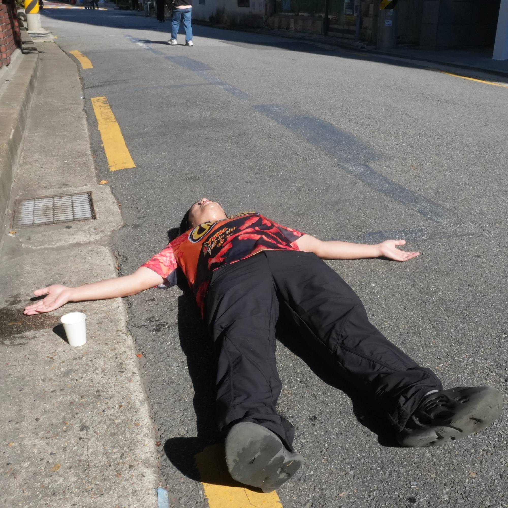
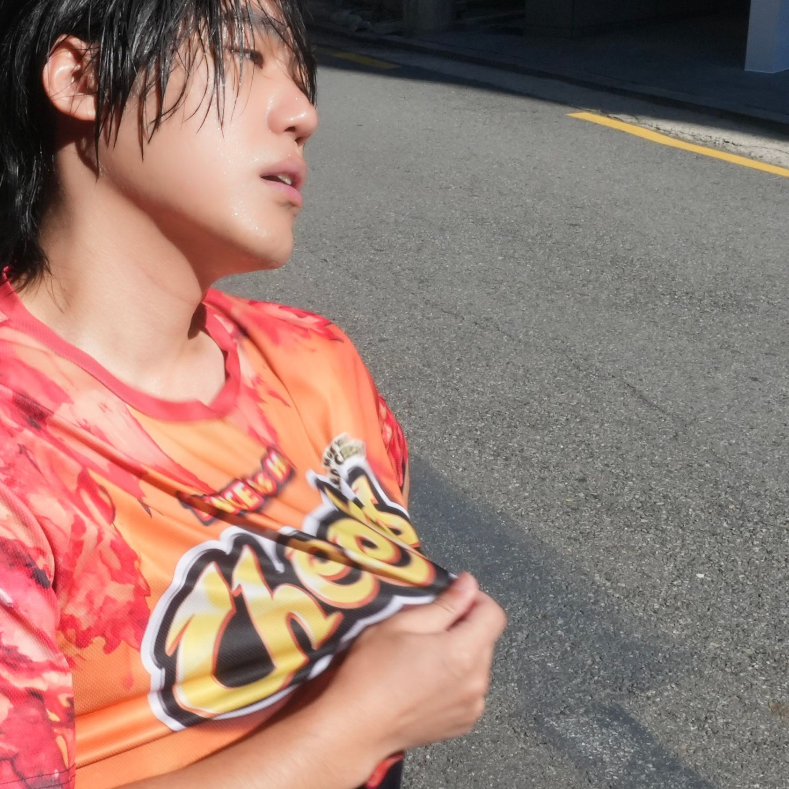
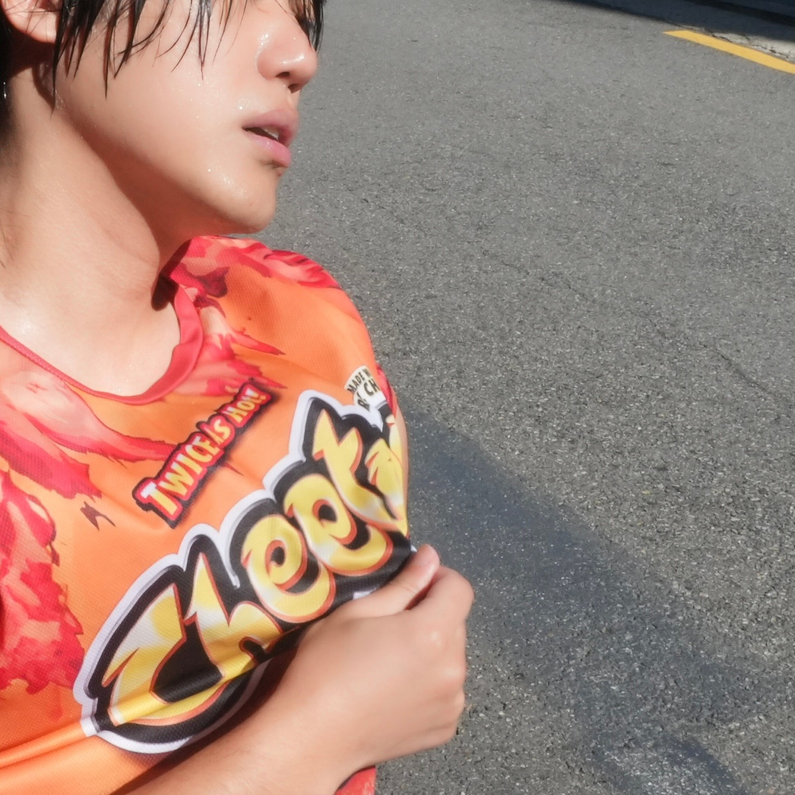

# 작업일지 — 2026-10-08

## 오늘 한 일
- 기획 방향 전환: 고상하고 세련된 방향에서 캐주얼하고 재치 있는 방향으로 바꿨다
- 표현 전략 확정: 사진은 덥게, 그래픽은 시원하게 (대비·전환)
- 1차 촬영 10컷 정리: [03_photos/selected/2026-10-08_1st-shoot/](../03_photos/selected/2026-10-08_1st-shoot/)

## 결과물

| | | | | |
|---|---|---|---|---|
|  |  |  |  |  |
|  |  |  |  |  |

## 피드백 / 고민
- 사진 이후의 최종 이미지 구성을 아직 협의하지 못했다
- 시각화 키워드가 5개(공기, 대비, 전환, 리듬, 입자)라서 가이드라인 기준인 3개로 줄여야 할지 고민 중이다

## 다음 할 일
- [ ] 사진과 그래픽을 합치는 방식 협의 (~2026-10-11 일)
- [ ] 합친 초안 만들기
